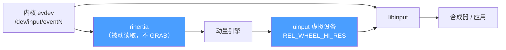

# rinertia

Linux 笔记本触摸板的动量滚动。

Synaptics 触摸板驱动曾提供动量（惯性）滚动功能——两指快速滑动后页面会继续滑行。当 Linux 桌面迁移到 libinput 后，这一功能被移除了。rinertia 以独立的用户空间守护进程形式将其带回，全系统生效，兼容任何 Wayland 合成器、任何应用，开箱即用。

## 工作原理



> rinertia 通过 evdev 被动读取触摸板事件，计算动量后通过 uinput 虚拟设备注入滚动事件。注入的事件经由 libinput 流入合成器——与真实输入设备走相同路径。由于从不抢占触摸板，正常滚动、手势和 [fusuma](https://github.com/iberianpig/fusuma) 等工具完全不受影响。

rinertia 通过 evdev 直接从 `/dev/input/eventN` 读取原始触摸板事件，**不依赖也不干扰 libinput**。由于从不抢占设备，你的合成器、libinput 以及手势工具（如 [fusuma](https://github.com/iberianpig/fusuma)）完全不受影响。

## 特性

- **即插即用** — 自动检测触摸板，直接运行
- **无侵入** — 被动读取事件，从不抢占触摸板
- **全局生效** — GTK、Qt、Electron、Firefox 等所有应用
- **可中断** — 触摸触摸板、按键或移动鼠标立即停止
- **可调优** — 阻尼、衰减曲线、速度均可调节

## 安装

```bash
cargo build --release
```

## 使用

```bash
# 开箱即用 — 自动检测触摸板，默认参数
sudo rinertia

# 按名称匹配触摸板
sudo rinertia -n "ELAN"

# 更长、更丝滑的惯性
sudo rinertia --damping 0.03 --linear-decel-ms 500

# 更短、更干脆的惯性
sudo rinertia --damping 0.10 --linear-decel-ms 200

# 纯指数衰减（无线性尾段）
sudo rinertia --damping-curve expo

# 排查问题 — 仅打印日志，不创建虚拟设备
sudo rinertia --dry --log-level debug

# 查看所有选项
rinertia --help
```

## 调优

| 参数 | 增大的效果 |
|------|-----------|
| `--damping` | 衰减更快，惯性更短 |
| `--tp-to-hires` | 每次手势滚动更远 |
| `--linear-decel-ms` | 尾段更慢、更长 |
| `--scroll-factor` | 每帧输出更多 |

## 滚动方向

rinertia 启动时会**自动检测**桌面环境的滚动方向设置。目前支持：

| 桌面环境 | 检测方式 |
|---------|---------|
| KDE Plasma | KWin D-Bus (`org.kde.KWin.InputDevice.naturalScroll`) |
| GNOME | gsettings (`org.gnome.desktop.peripherals.touchpad natural-scroll`) |
| 其他 | libinput 设备默认值（会打印警告） |

- **传统滚动**（默认）— 手指拖动滚动条。向下滑动 → 页面向下滚动。
- **自然滚动** — 手指和页面内容相对静止，像"抓"着页面拖动。向下滑动 → 页面向上滚动。

可通过 `--natural-scroll` 或配置文件中的 `natural_scroll = true` 手动覆盖自动检测值。如果手动设置与桌面环境设置冲突，rinertia 会打印警告。

## 已知问题

- **Chromium 系浏览器**自带 smooth scrolling，可能与 rinertia 叠加。可通过 `chrome://flags/#smooth-scrolling` 关闭，或用 `--scroll-factor` 补偿。
- `--tp-to-hires` 因设备而异 — 如果滚动过快或过慢，优先调这个参数。
- 指针惯性（`--mode pointer`）为实验性功能。

## 致谢

- [fusuma](https://github.com/iberianpig/fusuma) — 多点触控手势识别器，其架构启发了本项目的被动 evdev 监听设计
- [waynaptics](https://github.com/kekekeks/waynaptics) — Wayland synaptics 驱动适配层，本项目的双阶段动量引擎最初移植自该项目
- [xkeysnail](https://github.com/mooz/xkeysnail) — 基于 evdev 的按键重映射工具，其被动 evdev 监听方式为本项目的无 GRAB 设计提供了参考

## 许可

MIT
